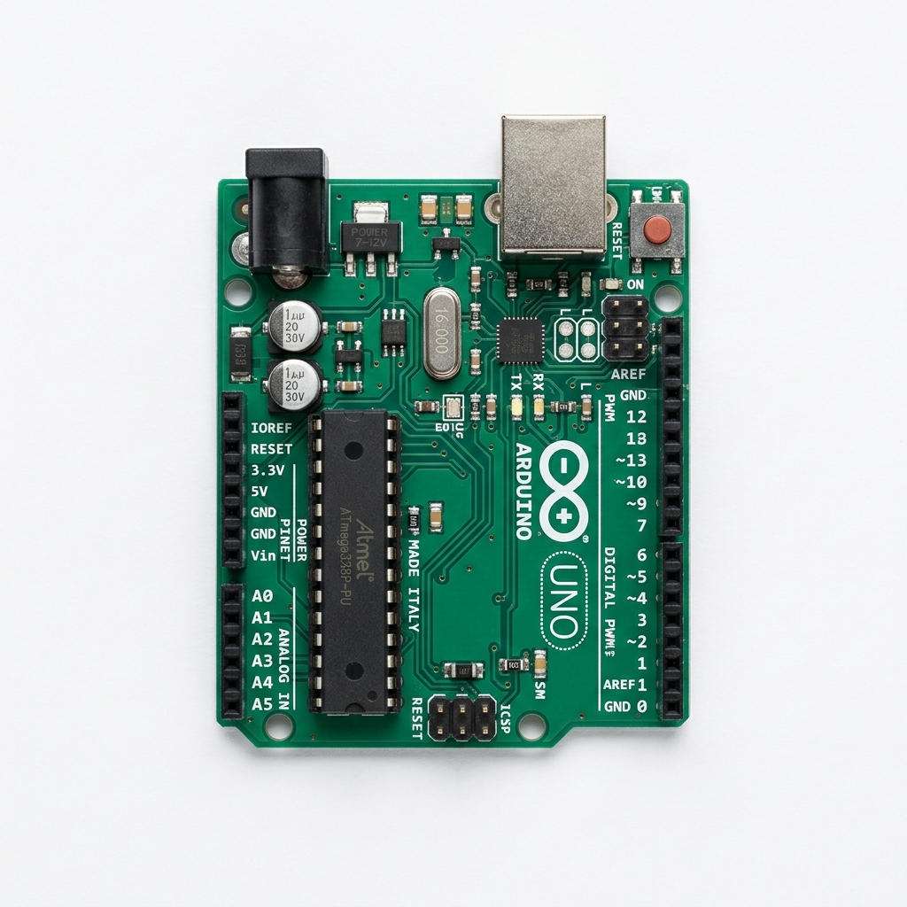
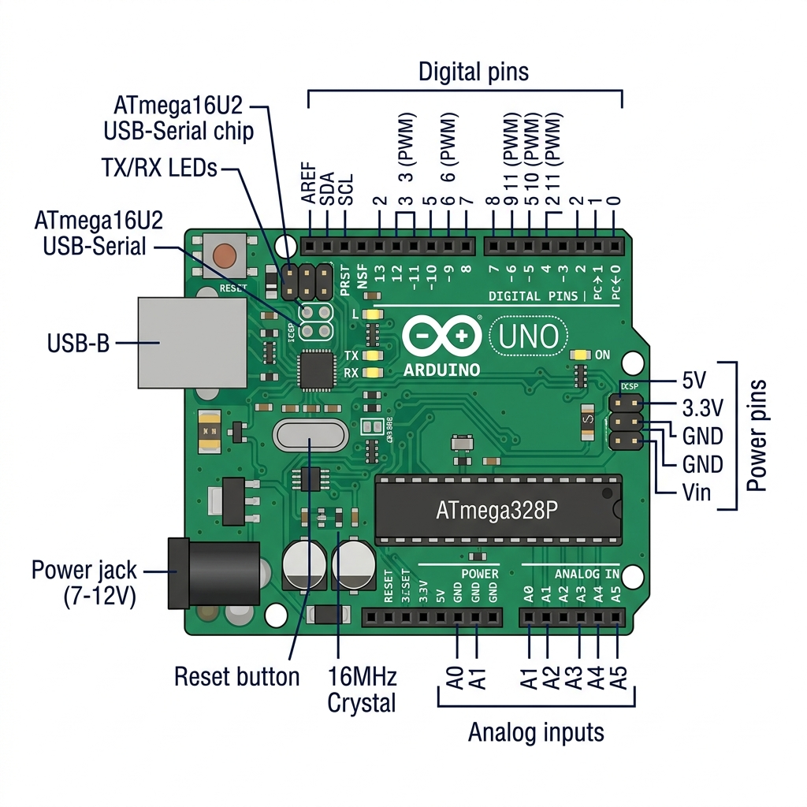
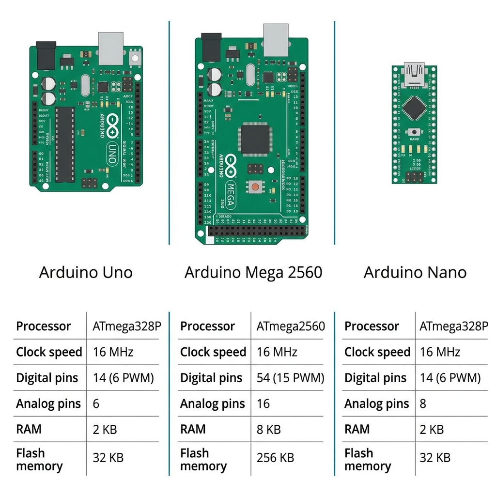
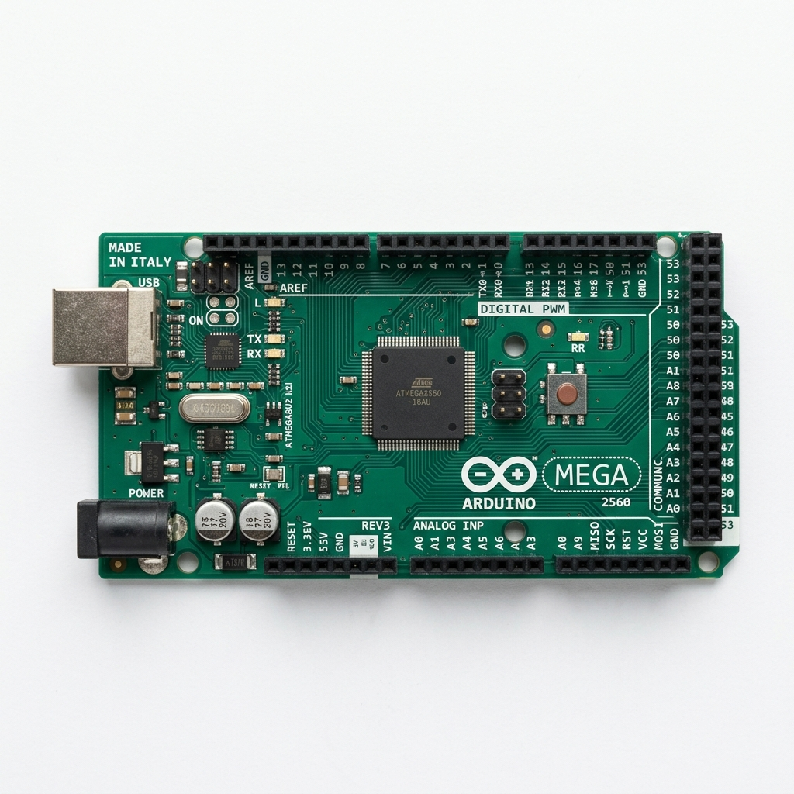
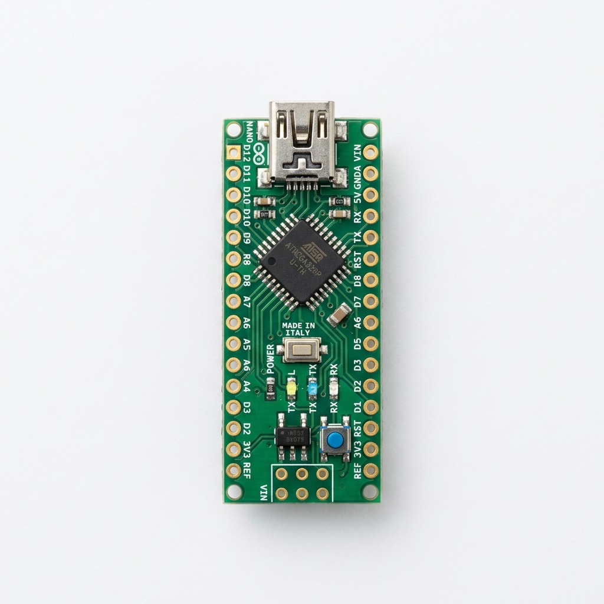
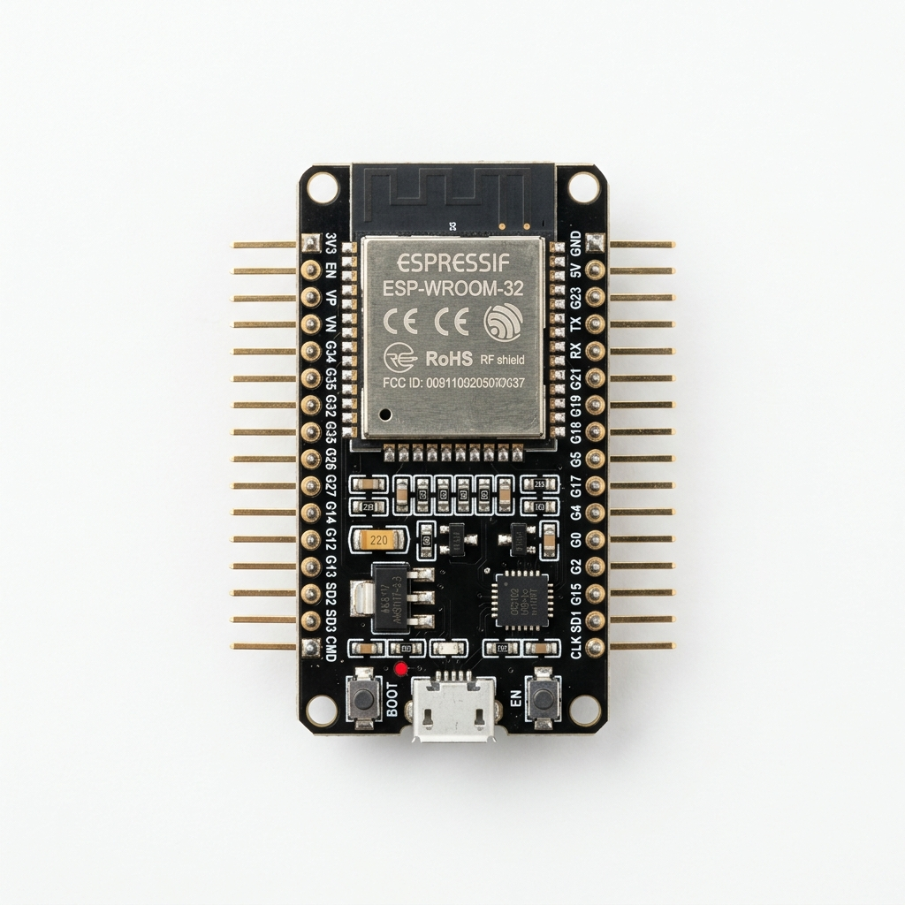

<!-- _class: cover -->

# Veille Technologique
## Microcontrôleurs & Arduino

**Groupe TP — Juin 2026**

---

## Quel est le rôle d'une carte Arduino ?



Une carte Arduino est une **plateforme de prototypage électronique** qui fait le lien entre le monde réel et le code informatique. Elle permet de :

- **Lire** des informations depuis l'environnement (capteurs de température, lumière, distance...)
- **Traiter** ces données via un programme chargé dans sa mémoire
- **Agir** sur l'environnement en contrôlant des actionneurs (moteurs, LEDs, écrans...)

C'est l'outil de référence pour apprendre l'électronique embarquée et réaliser des prototypes rapidement.

---

## Arduino Uno — Schéma complet des broches et composants



---

## Quelle est la différence entre Arduino Uno, Mega et Nano ?



| | **Uno** | **Mega** | **Nano** |
|--|---------|----------|----------|
| Format | Standard | Grand | Miniature |
| I/O num. | 14 | 54 | 14 |
| I/O ana. | 6 | 16 | 8 |
| Flash | 32 Ko | 256 Ko | 32 Ko |
| RAM | 2 Ko | 8 Ko | 2 Ko |

---

## Uno vs Mega vs Nano — Quelle carte choisir ?



**Arduino Uno** — La carte idéale pour débuter. Simple, bien documentée, parfaite pour la majorité des projets d'apprentissage et de prototypage.

**Arduino Mega** — Conçue pour les projets complexes nécessitant de nombreuses entrées/sorties : 54 broches numériques, 16 entrées analogiques, 4 ports série matériels.

**Arduino Nano** — Même puissance que l'Uno dans un format 3x plus petit. Idéale pour les projets compacts ou portables.

---

## Arduino Nano — La carte miniature en détail



La Nano embarque le même ATmega328P que l'Uno mais dans un format ultra-compact qui s'enfiche directement sur une breadboard.

**Points forts :**
- 8 entrées analogiques (vs 6 sur l'Uno)
- Pas besoin de shield pour prototypage
- Compatible avec les mêmes bibliothèques que l'Uno

**Contraintes :**
- Pas de connecteur jack d'alimentation
- Port Mini-USB ou Micro-USB selon la version
- Courant de sortie par broche identique (40 mA max)

---

## Pourquoi l'ESP32 est-il souvent utilisé pour les projets IoT ?



L'ESP32 est devenu un standard dans l'Internet des Objets car il intègre nativement ce qu'il faut acheter en plus pour un Arduino Uno classique :

- **Wi-Fi et Bluetooth inclus** directement sur la puce, sans module externe.
- **Processeur double-cœur à 240 MHz** contre 16 MHz monocœur pour l'Uno, soit une puissance bien supérieure.
- **Mémoire généreuse** (520 Ko de RAM) permettant de faire tourner des protocoles réseau comme HTTPS ou MQTT.
- **Modes de veille profonde** pour économiser la batterie dans les objets autonomes.
- Prix comparable à un Arduino Uno, ce qui en fait un choix rationnel pour tout projet connecté.

---

## Quelles sont les principales entrées et sorties disponibles sur une carte Arduino ?

<!-- IMAGE: chercher sur Google "Arduino Uno pinout diagram" → sauvegarder dans images/arduino_pinout_diagram.png -->
<!--  -->

Une carte Arduino expose plusieurs types de connexions physiques :

| Type | Broches | Utilité concrète |
|------|---------|-----------------|
| Numériques | D0 à D13 | Lire un bouton, allumer une LED |
| PWM | D3, 5, 6, 9, 10, 11 | Varier vitesse moteur ou intensité LED |
| Analogiques | A0 à A5 | Lire potentiomètre, LDR, capteur de gaz |
| Alimentation | 5V, 3.3V, GND | Alimenter capteurs et modules |
| Communication | TX/RX, SDA/SCL | Liaisons série, I2C, SPI |

---

## Quelle est la différence entre une entrée analogique et une entrée numérique ?

<!-- IMAGE: chercher sur Google "digital vs analog signal arduino" → sauvegarder dans images/analog_vs_digital.png -->
<!--  -->

**Entrée numérique** : deux états uniquement — HAUT (5V) ou BAS (0V). Pour des interrupteurs ou capteurs tout-ou-rien. Fonction : `digitalRead()`.

**Entrée analogique** : tension continue entre 0V et 5V, convertie en valeur entre **0 et 1023** (10 bits). Pour quantifier des grandeurs physiques. Fonction : `analogRead()`.

> Exemple : un bouton → numérique. Un capteur de luminosité (LDR) → analogique.

---

## À quoi servent les fonctions setup() et loop() dans Arduino ?

Tout programme Arduino repose sur deux fonctions obligatoires :

**`setup()`** — exécutée **une seule fois** au démarrage ou après un reset. On y initialise le programme : configuration des broches, démarrage de la communication série, initialisation des capteurs.

**`loop()`** — exécutée **en boucle infinie** juste après. C'est le coeur du programme : lecture des capteurs, prise de décision, contrôle des sorties. Elle tourne sans jamais s'arrêter tant que la carte est alimentée.

```
Démarrage → setup() → loop() → loop() → loop() → ...
```

---

## Comment un Arduino communique-t-il avec un ordinateur ?

<!-- IMAGE: chercher sur Google "arduino USB UART communication diagram" → sauvegarder dans images/usb_uart.png -->
<!--  -->

L'Arduino communique avec l'ordinateur via le câble USB. Une puce dédiée (ATmega16U2 sur les cartes officielles, CH340 sur les clones) **convertit le signal USB en protocole UART**, compris par le microcontrôleur.

```cpp
Serial.begin(9600);       // initialiser la liaison à 9600 bauds
Serial.println(valeur);   // envoyer une valeur vers l'ordinateur
```

---

## Qu'est-ce que le moniteur série ?

Le moniteur série est un **outil de débogage et de communication** intégré à l'IDE Arduino. Il affiche en temps réel les données que l'Arduino envoie via `Serial.println()`.

Il est indispensable pour :
- Vérifier les valeurs lues par les capteurs
- Suivre l'exécution d'un programme étape par étape
- Envoyer des commandes textuelles depuis l'ordinateur vers la carte

**Accès** : Outils > Moniteur Série (ou Ctrl+Shift+M). La vitesse sélectionnée doit correspondre à celle déclarée dans `Serial.begin()`.

---

## Quel est le rôle d'un module Wi-Fi ESP8266 ?

<!-- IMAGE: chercher sur Google "ESP8266 ESP-01 module photo" → sauvegarder dans images/esp8266.png -->
<!--  -->

L'ESP8266 est un module Wi-Fi qui ajoute la connectivité réseau à un microcontrôleur qui n'en possède pas nativement.

- Communique avec l'Arduino via des **commandes AT** sur liaison série
- En version NodeMCU : fonctionne **seul sans Arduino**
- Utilisé pour envoyer des données vers un serveur ou appeler une API web

---

## Comment connecter un capteur à une carte Arduino ?

<!-- IMAGE: chercher sur Google "arduino sensor wiring breadboard DHT11" → sauvegarder dans images/capteur_branchement.png -->
<!--  -->

La connexion suit toujours le même schéma à trois fils :

| Broche du capteur | Connectée à | Raison |
|-------------------|-------------|--------|
| VCC (ou +) | 5V ou 3.3V de l'Arduino | Alimenter le capteur |
| GND (ou -) | GND de l'Arduino | Référence commune de tension |
| SIG / OUT / DATA | Broche numérique ou analogique | Transmettre la mesure |

Sortie tension variable (LDR) → broche **analogique (A0-A5)**.
Signal binaire (DHT11) → broche **numérique (D2-D13)**.

---

## Comment commander un actionneur avec Arduino ?

<!-- IMAGE: chercher sur Google "arduino relay module wiring diagram" → sauvegarder dans images/actionneur_relais.png -->
<!--  -->

**Faible puissance (< 40 mA)** : connexion directe avec résistance en série. Pour LEDs, buzzers passifs.

**Forte puissance** : interface intermédiaire obligatoire :
- **Transistor MOSFET** pour moteur DC
- **Relais** pour circuits 220V
- **Pont en H (L298N)** pour contrôler le sens de rotation

L'Arduino commande l'interrupteur, une alimentation externe alimente l'actionneur.

---

## Qu'est-ce qu'une bibliothèque Arduino ?

Une bibliothèque est un ensemble de fonctions préconçues qui simplifient la communication avec des composants complexes. Au lieu de programmer la séquence d'octets nécessaire pour interroger un capteur, on appelle une fonction lisible.

**Sans bibliothèque** : 30 lignes de gestion de protocoles bas niveau.
**Avec bibliothèque** : `float t = dht.readTemperature();` — une seule ligne.

Les bibliothèques les plus courantes :
- **DHT.h** — capteur de température et humidité
- **Servo.h** — contrôle de servomoteurs
- **LiquidCrystal_I2C.h** — écran LCD sur bus I2C
- **Wire.h** — communication I2C générique

Installation : Croquis > Inclure une bibliothèque > Gérer les bibliothèques.

---

## Quel est le rôle des broches VCC, GND, SIG, AO et DO sur un module électronique ?

<!-- IMAGE: chercher sur Google "arduino sensor module VCC GND SIG pins" → sauvegarder dans images/module_pins.png -->
<!--  -->

Ces étiquettes se retrouvent sur la quasi-totalité des modules du kit :

| Broche | Nom complet | Rôle |
|--------|-------------|------|
| VCC | Tension d'alimentation | Reçoit le +5V ou +3.3V |
| GND | Ground (masse) | Référence électrique commune (0V) |
| SIG | Signal | Entrée ou sortie de données |
| AO | Analog Output | Tension continue proportionnelle à la mesure |
| DO | Digital Output | Signal binaire selon un seuil réglable |

---

## Comment identifier les broches d'un capteur sans documentation ?

<!-- IMAGE: chercher sur Google "reading PCB silkscreen Arduino module" → sauvegarder dans images/pcb_silkscreen.png -->
<!--  -->

1. **Sérigraphie** : lire les étiquettes gravées sur le PCB des deux côtés
2. **Référence de la puce** : chercher "LM393 datasheet" sur Google
3. **Multimètre** : le GND est relié aux grandes surfaces de cuivre
4. **Potentiomètre visible** : présence d'une sortie DO à seuil réglable

---

## Quelles sont les limites d'une carte Arduino pour une application complexe ?

L'Arduino Uno est excellent pour apprendre et prototyper, mais montre ses limites pour des applications exigeantes :

| Limite | Explication |
|--------|-------------|
| Mémoire réduite | 2 Ko de RAM — impossible de gérer des chaînes longues ou des tableaux importants |
| Mono-tâche | `delay()` bloque complètement le programme — aucun multitâche natif |
| Pas de réseau | Aucun Wi-Fi ni Bluetooth intégré |
| Vitesse limitée | 16 MHz ne permettent pas de traitement audio/vidéo ou calculs complexes |
| Pas de sécurité | Aucun moteur de chiffrement pour des communications sécurisées |

---

## Dans quels cas faut-il préférer l'ESP32 à l'Arduino Uno ?

L'ESP32 s'impose lorsque le projet dépasse les capacités de l'Uno :

- Le projet doit envoyer ou recevoir des données via **Wi-Fi ou Bluetooth**.
- Le traitement de données est **intensif** (audio, cryptographie légère, protocoles réseau).
- On a besoin d'exécuter **plusieurs tâches simultanément** grâce à FreeRTOS sur les deux coeurs.
- L'objet doit fonctionner sur **batterie** avec une consommation minimale (mode deep sleep).

Pour un projet de démarrage sans réseau, l'Uno reste suffisant et plus simple à prendre en main.

---

## Comment choisir le bon port série dans Arduino IDE ?

<!-- IMAGE: chercher sur Google "Arduino IDE select port menu" → sauvegarder dans images/ide_port.png -->
<!--  -->

1. Ouvrir **Outils > Port** et noter les ports présents
2. **Débrancher** la carte Arduino
3. **Rebrancher** : le nouveau port = votre carte

Noms typiques :
- Windows : `COM3`, `COM7`...
- Linux : `/dev/ttyACM0` ou `/dev/ttyUSB0`

---

## Comment choisir le bon modèle de carte dans Arduino IDE ?

<!-- IMAGE: chercher sur Google "Arduino IDE board selection menu" → sauvegarder dans images/ide_board.png -->
<!--  -->

1. Aller dans **Outils > Type de carte > Arduino AVR Boards**
2. Sélectionner le modèle exact : **Arduino Uno**, **Mega**, **Nano**...
3. Pour ESP32/ESP8266 : ajouter l'URL dans les Préférences puis installer via le Gestionnaire de cartes

Un mauvais choix de carte peut bloquer le téléversement.

---

## Quelle est la différence entre compiler et téléverser un programme ?

Ces deux actions sont souvent confondues mais sont bien distinctes :

**Compiler (Vérifier)** : l'ordinateur traduit le code C++ écrit par le développeur en langage machine binaire (fichier `.hex`). Cette étape ne nécessite pas que la carte soit branchée. Elle détecte les erreurs de syntaxe et les problèmes de logique structurelle.

**Téléverser (Upload)** : compile d'abord le programme, puis transfère le binaire vers la mémoire flash du microcontrôleur via le câble USB. Un petit programme préinstallé sur l'Arduino, appelé **bootloader**, gère la réception et l'écriture de ce fichier.

---

## Que signifie le terme « baud rate » dans une communication série ?

Le baud rate est la **vitesse de communication** d'une liaison série, exprimée en bits transmis par seconde.

- `9600` bauds signifie que 9 600 bits sont échangés chaque seconde.
- Valeurs courantes : `9600`, `19200`, `57600`, `115200`.

Cette valeur doit être **identique** des deux côtés de la communication. Si l'Arduino envoie à 9600 et que le Moniteur Série écoute à 115200, les bits sont lus au mauvais rythme et le texte affiché sera illisible (symboles aléatoires).

Déclaration dans le code : `Serial.begin(9600);`
Sélection dans le Moniteur Série : menu déroulant en bas à droite.

---

## Comment tester un capteur avant de l'intégrer dans un projet complet ?

Avant d'intégrer un capteur dans un projet complet, il est recommandé de le tester de manière isolée pour s'assurer qu'il fonctionne correctement :

1. Connecter uniquement le capteur à l'Arduino sur une breadboard.
2. Écrire un code minimal qui lit la valeur et l'affiche sur le Moniteur Série.
3. Provoquer des variations de la grandeur mesurée (approcher la main, couvrir la lumière...) et vérifier que les valeurs réagissent logiquement.
4. Si le capteur répond bien, l'intégrer ensuite dans le projet principal.

Cette isolation évite de passer des heures à chercher un bug dans un montage complexe.

---

## Comment savoir si une erreur vient du code, du câblage ou du capteur ?

Face à un comportement anormal, il faut identifier si le problème vient du code, du câblage ou du composant lui-même :

| Hypothèse | Symptômes typiques | Vérification |
|------------|-------------------|--------------|
| **Code** | Valeurs brutes correctes, comportement logique faux | Relire les conditions `if`, les conversions, les seuils |
| **Câblage** | Valeur bloquée à 0 ou 1023, composant chaud | Multimètre, vérifier chaque connexion |
| **Capteur HS** | Exemple officiel + câblage vérifié → résultat impossible | Remplacer le composant |

La règle est de toujours tester avec un exemple de bibliothèque certifié avant de conclure à une panne matérielle.

---

## Quels composants utiliser pour une station de surveillance intelligente d'une salle ?

<!-- IMAGE: chercher sur Google "arduino smart room monitoring station diagram" → sauvegarder dans images/station_surveillance.png -->
<!--  -->

Objectif : surveiller en temps réel la température, la luminosité et la sécurité d'une salle.

**Capteurs :** DHT11 (temp/humidité), LDR (lumière), PIR (mouvement)

**Actionneurs :** LED RVB (statut), Buzzer (alarme), LCD I2C (affichage)

**Logique :**
- Mouvement détecté → alerte rouge + buzzer
- Température > 28°C → alerte orange + bip
- Normal → LED verte + lecture toutes les secondes

---

## Classification et rôle des composants du kit

<!-- IMAGE: chercher sur Google "arduino starter kit components photo" → sauvegarder dans images/kit_composants.png -->
<!--  -->

| Composant | Catégorie | Rôle principal |
|-----------|-----------|----------------|
| Arduino Uno | Contrôle | Exécute le programme |
| Breadboard + fils | Prototypage | Connexions sans soudure |
| DHT11 | Capteur | Température et humidité |
| LDR | Capteur | Luminosité ambiante |
| HC-SR04 | Capteur | Distance par ultrasons |
| PIR | Capteur | Détection de mouvement |
| LED / LED RVB | Actionneur | Signalisation visuelle |
| Buzzer | Actionneur | Signalisation sonore |
| Relais 5V | Actionneur | Circuits 220V |
| Servomoteur SG90 | Actionneur | Mouvement angulaire (0°-180°) |
| Potentiomètre | Passif | Réglage manuel |

---

---

## Conclusion — Points clés à retenir

- Arduino est la porte d'entrée de l'électronique embarquée : simple, documenté, communauté massive.
- ESP32 est l'évolution naturelle pour tout projet qui nécessite du réseau ou plus de puissance.
- Les fonctions `setup()` et `loop()` sont la colonne vertébrale de tout programme Arduino.
- Le baud rate doit être identique côté code et côté Moniteur Série pour une communication lisible.
- La méthode : tester chaque composant seul avant d'assembler un système complet.
- En cas d'erreur, éliminer méthodiquement les hypothèses — code, câblage, puis composant.

---
*Merci de votre attention — Place à la démonstration pratique.*
